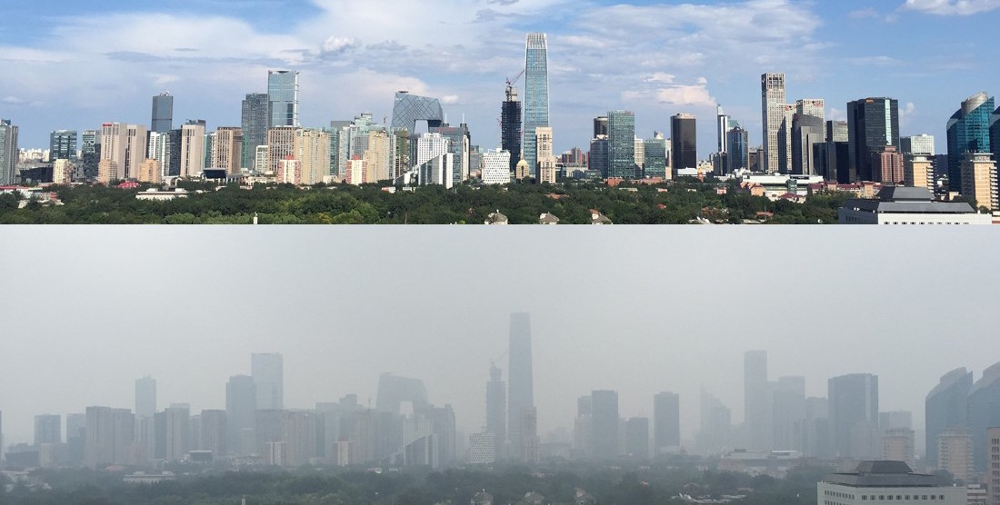

```{r setup, include=FALSE}
knitr::opts_chunk$set(echo = TRUE)
library(dynlm)
library(lubridate)
library(magrittr)
library(tidyr)
library(dplyr)
library(ggplot2)
library(tsibble)
library(fable)
library(stats)
library(fpp3)
library(modeltime) # automatic forecasting using machine learning
library(timetk)

```

# The goal of the project

The goal of this project  is to conduct a comprehensive study of pollution and air conditions in the city of Beijing using various advanced time series techniques, including both statistical and machine learning approaches. By focusing on hourly predictions, the project aims to provide valuable insights and tools for monitoring and managing air quality in Beijing at a granular level. 

We will first explore the data and do the necessary preprocessing, later we will implement dynamic regression as well as some multivariate models. Finally we will develop some machine learning models. We will visualize all the necessary plots as well as prediction intervals.

# The data set

The data set we will use is one that that reports on the weather and the level of pollution each hour for five years at the US embassy in Beijing, China.

The data includes the date-time, the pollution called PM2.5 concentration, and the weather information including dew point, temperature, pressure, wind direction, wind speed and the cumulative number of hours of snow and rain. 

```{r cars}
rm(list=ls())
df_pollution = read.csv("beijin_pollution.csv")
```

```{r, out.width='110%', fig.align='center', echo=FALSE}


```

# Exploratory data analysis and data processing

In the initial stages of the project, we conduct an exploratory data analysis  to gain insights into the structure and distribution of our dataset. We will asses other preprocessing steps necessary for the ML implementations in further sections.

*Data structure*

```{r pressure}
str(df_pollution)
```

We will now convert the date into Date format and add the features of hour and month to the data set.

```{r}
# Convert 'date' column to POSIXct format to include both date and time
df_pollution$date <- as.POSIXct(df_pollution$date)

# Extract hour from the 'date' variable
df_pollution$hour <- hour(df_pollution$date)

# Extract month from the 'date' variable
df_pollution$month <- month(df_pollution$date)

```

*Missing values*

```{r}
# Check for missing values
missing_values <- colSums(is.na(df_pollution))
print(missing_values)
```

*Correlation matrix*
In order to understand the relationships between variables in our dataset, we construct a correlation matrix. 
```{r}
numeric_vars <- sapply(df_pollution, is.numeric)
numeric_df <- df_pollution[, numeric_vars]
# Correlation plot
correlation_matrix <- cor(df_pollution[, c("pollution","temp","wnd_spd","dew","press", "hour", "month", "rain","snow")])
print(correlation_matrix)
```

### Time series plots

The following ime series plots visually depict variable trends over time, aiding in identifying patterns and anomalies. By examining these plots, we gain insights into air quality dynamics and guide subsequent modeling efforts. We have chosen to discard the "snow" variable given it was not a consistent variable throught the year. 

```{r}
# Reshape the data to long format
df_pollution1 <- df_pollution %>%
  select(date, pollution, temp, dew, press, wnd_spd,rain) %>%
  pivot_longer(cols = c(pollution, temp, dew, press, wnd_spd,rain), names_to = "Variable", values_to = "Value")

# Plot time series of multiple variables
ggplot(df_pollution1, aes(x = date, y = Value)) +
  geom_line() +
  facet_wrap(~ Variable, scales = "free_y", nrow = 3) +
  labs(x = "Date", y = "Value", title = "Time Series of Multiple Variables (2010-2014)")

```

We observe some clear patterns in the temperature, dew point and pressure. Showing the distinguishly the 5 years we have in the data set. We can as swell oberve some pattern in the pollution, rain and wind speed variables.

## Split the data

To facilitate model training and evaluation, we partition the dataset into distinct subsets. This division typically includes a training set for model fitting and a separate test set for performance evaluation. 

We will use as training set two months and as testing set one week.

```{r}
# Transform data frame into tsibble
df_pollution = df_pollution %>% as_tsibble(index = date)

# Train data
pollution.train <- df_pollution %>%
  filter(year(date) == 2014 & month(date) <= 11 & month(date) >= 10) %>%
  mutate(pollution = pollution,
         temp = temp,
         dew = dew,
         press = press,
         wnd_spd = wnd_spd)

# Test data
pollution.test <- df_pollution %>%
  filter(year(date) == 2014 & month(date) == 12 & day(date)<=7) %>%
  mutate(pollution = pollution,
         temp = temp,
         dew = dew,
         press = press,
         wnd_spd = wnd_spd)
```

## Decomposition of the time series

In this phase, we decompose the time series into its constituent components trend, seasonality, and residual.
The descending trend observed in pollution levels over the years serves as a crucial indicator of long-term air quality dynamics. 
```{r}
dcmp <- df_pollution |>
  model(stl = STL(pollution))
components(dcmp) |> autoplot()
```

```{r}
dcmp <- df_pollution |>
  model(stl = STL(temp))
components(dcmp) |> autoplot()
```

```{r}
dcmp <- df_pollution |>
  model(stl = STL(press))
components(dcmp) |> autoplot()
```

```{r}
dcmp <- df_pollution |>
  model(stl = STL(dew))
components(dcmp) |> autoplot()
```

```{r}
dcmp <- df_pollution |>
  model(stl = STL(wnd_spd))
components(dcmp) |> autoplot()
```

```{r}
dcmp <- df_pollution |>
  model(stl = STL(rain))
components(dcmp) |> autoplot()
```

As established before weather variables have clear seasonality trends.


# Automatic Dynamic regression

In this section, we employ automatic methods to identify potential relationships and dependencies within the pollution time series data. We begin by visualizing the autocorrelation and partial autocorrelation functions of the pollution indices using the ACF and PACF functions, respectively. These plots provide insights into the temporal dependencies and lagged relationships present in the pollution data, guiding the selection of appropriate lag variables for modeling. A maximum lag of 72 is chosen showing the autocorrelation within the last 3 days.
```{r}
df_pollution |> ACF(pollution, lag_max = 72) |> autoplot()+
  labs(title = "Autocorrelation function of pollution indices")
df_pollution |> PACF(pollution, lag_max = 72) |> autoplot()+
  labs(title = "Partial autocorrelation function of pollution indices")
```

The descending trend in the autocorrelation function and the initial spike in the partial autocorrelation function indicates a strong correlation between the pollution values at lag 1 and the current observation, suggesting a significant immediate impact of past pollution levels on the present. This is the reason why we will incorporate the variable lag(pollution, 1) into the model. 

We will also include the variable hour to the model as well as other weather features that might have relevance

```{r}
fit <- pollution.train%>% # training set
  model(ARIMA(pollution ~ lag(pollution, 1) + temp+ dew + press + month+ wnd_spd + hour, stepwise=F)) 
report(fit)
```

### Forecast and prediction intervals

Now we will fore cast and visualize the predictions for the first week of December, as well as the prediction intervals

```{r,fig.width=16}
# Forecast plot
forc = forecast(fit, new_data = pollution.test) 
forc %>% 
  autoplot(df_pollution[42600:43225,],color="red")+
  ggtitle("Dynamic Regression forecast")

```

We observe that implementing dynamic regression for forecasting pollution gives us great results.

# Multivariate time series

In this section, we delve into the complexities of multivariate time series analysis, where multiple variables interact and influence each other over time. 

Given the previous analysis we will study the features of pollution, temperature, dew point, pressure, wind speed and rain.

It is clear that some weather variables such as rain might not be directly dependent on the pollution, although it is interesting to see all the different predictions made by the different models implemented.

```{r}
fit_multi <- pollution.train %>%
  model(
    VAR1a = VAR(
      vars(pollution, temp, dew, press, wnd_spd, rain) ~ 0 + AR(1)
    ),
     VAR1b = VAR(
      vars(pollution, temp, dew, press, wnd_spd, rain) ~ 1 + AR(1)
    ), 
    aicc = VAR(
      vars(pollution, temp, dew, press, wnd_spd, rain),
      ic = "aicc"
    ),
    bic = VAR(
      vars(pollution, temp, dew, press, wnd_spd, rain),
      ic = "bic"
    )
  )

```

Let's see now the  AIC, AICc and BIC metrics of the different models.

```{r}
fit_multi
glance(fit_multi)

```

### Forecast and predictions

```{r, fig.width=16}
fit_multi%>%
  forecast(h=168) %>% 
  autoplot(df_pollution[42800:43225,],color="red",level = NULL)
```

We observe that depending on the variable we are forecasting we are able to get more or less accurate results. This is due to the nature of the variables. Since it is likely that not all variables are dependent on the otherones.

# Machine Learing

Given the nature of our data set, in the following section we will see different machine learning approaches to forecast the pollution variable. 

## Split in cross validation

We have implemented a time series cross-validation strategy, where the dataset is partitioned into training and testing sets based on temporal order. We have chosen to split the data in 4 separate splits with a training window of 4 months and a testing window of 7 days. Since the observations are done hourly we will input 1440 values for training and 168 for testing. 

```{r}

train_ml = as_tibble(df_pollution) 
splits <- time_series_cv(data = filter(train_ml), 
                         date_var = date,
                         initial     = 1440 , # window for train set 720 hours (2 months)
                         assess      = 168 , # h = 7 days
                         skip        = " 1 weeks", # forecast every year
                         slice_limit = 4, # maximum number of blocks/slices
                         cumulative  = FALSE)

```

Let's visualize the different slices.

```{r}
# visualize the splits
splits %>%
    plot_time_series_cv_plan(date, pollution, .interactive = FALSE)
```

We will show graphically the forecasts for one of the splits. We have chosen the split sp=4. Although we will compute the mean accuracy considering all the splits in order to select the best model.

We will preprocess the data set by scaling and centering all features. Some machine learning algorithms, such as gradient descent-based methods, converge faster when features are on a similar scale. Scaling ensures that each feature contributes equally to the model's optimization process.

```{r}
library(tidymodels)
sp = 4 # select here the split

# Define the recipe specification
recipe_spec <- recipe(pollution ~ ., data = training(splits$splits[[sp]])) %>%
  # Specify time series signature step
  step_timeseries_signature(date) %>%
  # Remove unnecessary variables
  step_rm(date_year, date_year.iso,
  date_half, date_quarter, date_minute,date_second,wnd_dir,date_month.lbl, date_wday.lbl) %>%
  # Perform additional preprocessing steps
  # For example, centering and scaling numeric variables
  step_center(all_numeric()) %>%
  step_scale(all_numeric())
```

We will try the following Machine learning models: glmnet, random forest, XGBoost, neural networks, and prophet.

For each model, we need to define a workflow.

## GLMNET

```{r}
library(glmnet)
library(parsnip)
library(workflows)
library(recipes)

# glmnet
model_spec_glmnet <- linear_reg(penalty = 0.01, mixture = 0.5) %>%
  set_engine("glmnet")

workflow_fit_glmnet <- workflow() %>%
  add_model(model_spec_glmnet) %>%
  add_recipe(recipe_spec %>% step_rm(date)) %>%
  fit(training(splits$splits[[sp]]))

```

## RANDOM FOREST

```{r}
# randomForest
model_spec_rf <- rand_forest(trees = 200, mode = "regression") %>%
  set_engine("randomForest")

workflow_fit_rf <- workflow() %>%
  add_model(model_spec_rf) %>%
  add_recipe(recipe_spec %>% step_rm(date)) %>%
  fit(training(splits$splits[[sp]]))

```

## XGBoost

```{r}
# XGBoost
model_spec_xgboost <- boost_tree(mode = "regression") %>%
    set_engine("xgboost")

wflw_fit_xgboost <- workflow() %>%
    add_model(model_spec_xgboost) %>%
    add_recipe(recipe_spec %>% step_rm(date)) %>%
    fit(training(splits$splits[[sp]]))

```

## NNTAR

```{r}
# NNETAR
model_spec_nnetar <- nnetar_reg(seasonal_period = 24, mode = "regression") %>%
    set_engine("nnetar")

wflw_fit_nnetar <- workflow() %>%
    add_model(model_spec_nnetar) %>%
    add_recipe(recipe_spec) %>%
    fit(training(splits$splits[[sp]]))

```

## PROPHET

```{r}

# Prophet with all the features
model_spec_prophet <- prophet_reg(
      seasonality_yearly = FALSE
    ) %>%
    set_engine("prophet") 

wflw_fit_prophet <- workflow() %>%
    add_model(model_spec_prophet) %>%
    add_recipe(recipe_spec) %>%
    fit(training(splits$splits[[sp]]))

```

We will now create a model_table to aggregate all teh models we are trying.

```{r}
model_table <- modeltime_table(
  workflow_fit_glmnet,
  workflow_fit_rf,
  wflw_fit_xgboost,
  wflw_fit_nnetar,
  wflw_fit_prophet
) 
model_table
```

```{r}
calibration_table <- model_table %>%
  modeltime_calibrate(new_data = testing(splits$splits[[sp]]))
calibration_table
```

We will now plot the forecasts.

```{r}
modeltime_forecast(model_table, new_data = testing(splits$splits[[sp]])) %>%
  plot_modeltime_forecast(.interactive = FALSE) + labs(title = "Forecasts",    y = "",    caption = "modeltime" )

```

```{r}
calibration_table %>%
  modeltime_accuracy() %>%
  table_modeltime_accuracy(.interactive = FALSE)
```

We will calculate the average accuracy obtained through each split so we can get an overall sense of how each model behaves in general.


```{r}
# Initialize an empty list to store accuracy results for each fold
accuracy_results <- list()

# Iterate over each split
for (sp in 1:length(splits$splits)) {
  # Calibrate models for the current fold's testing set
  calibration <- model_table %>%
    modeltime_calibrate(new_data = testing(splits$splits[[sp]]))
  
  # Calculate accuracy for the calibrated models
  accuracy <- calibration %>%
    modeltime_accuracy()
  
  # Store the accuracy results for the current fold
  accuracy_results[[sp]] <- accuracy
}

# Combine accuracy results for all folds into a single tibble
combined_accuracy <- bind_rows(accuracy_results)

# Aggregate mean accuracy across all folds
mean_accuracy <- combined_accuracy %>%
  group_by(.model_id) %>%
  summarize(across(.cols = starts_with("MAPE"):starts_with("RMSE"), mean, na.rm = TRUE)) %>%
  ungroup()

# Print the mean accuracy table
print(mean_accuracy)

```

To quantify the performance of our models, we employed various evaluation metrics, including Mean Absolute Percentage Error (MAPE), Root Mean Squared Error (RMSE), and others. These metrics provided insights into the accuracy and reliability of our predictions, enabling us to compare and select the best-performing models for deployment.


Based on the previous metric analyisis we could choose as the best machine learning model the XgBoost. This could be expected as XgBoost is an excellent tool when approaching time series problems. Let's plot the results as well as the prediction intervals.

```{r}
model_table1 = modeltime_table(
  wflw_fit_xgboost
) 
calibration1 <- model_table1 %>%
    modeltime_calibrate(new_data = testing(splits$splits[[sp]]))

# Forecast using the calibrated models and the filtered data
forecasts <- calibration1 %>%
  modeltime_forecast(new_data = testing(splits$splits[[sp]]),  conf_interval = 0.95)

# Plot the forecasts
forecasts %>%
  plot_modeltime_forecast(.interactive = FALSE) +
  labs(title = "Forecasts", y = "", caption = "modeltime") +
  theme_minimal()

```

# Conclusions

In this project we have studied several advanced time series models, both with pollution as the only target and with multivariate modeling. Statistical tools have showed the trends and seasonal patterns in pollution data, enabling us to make accurate forecasts and understand the underlying dynamics. Through exploratory data analysis, we uncovered important insights such as descending trends in pollution levels over the years. Additionally, multivariate modeling has provided a deeper understanding of the interplay between pollution and various environmental factors. Overall, our comprehensive study has equipped us with valuable tools to address pollution challenges and make informed decisions for environmental management.


Overall, this project showcased the effectiveness of leveraging advanced time series techniques and machine learning algorithms to analyze and forecast pollution levels, contributing to the understanding and management of air quality in urban environments like Beijing.

